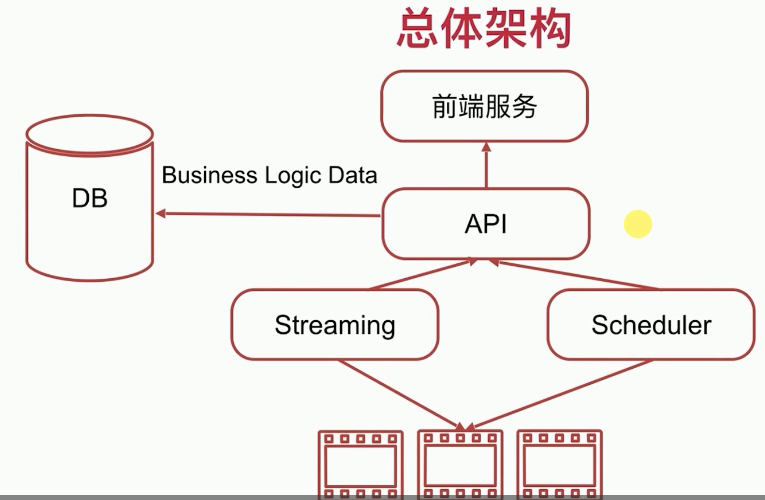
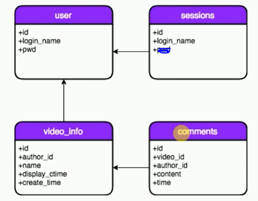
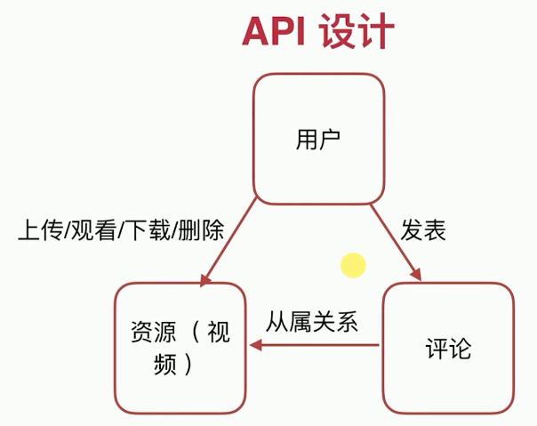

# 备忘录

和JAVA开发不一样，这里各个服务独立，可以单独部署运行。大服务可以按照MVC组织代码包，小服务不用那么细分了

在代码一些细节点注意加上注释

最后重构工程结构，原来的services混乱

结构体定义的tag

包init函数

[`fmt.Println`]doesn't do formatting things like `%d`. Instead, it uses the default format of its arguments, and adds spaces between them.

```golang
fmt.Println("Hello, playground",i)  // Hello, playground 5
```

If you want printf style formatting, use [`fmt.Printf`](https://golang.org/pkg/fmt/#Printf).

```golang
fmt.Printf("Hello, playground %d\n",i)
```

And you don't need to be particular about the type. `%v` will generally figure it out.

```go
fmt.Printf("Hello, playground %v\n",i)
```

​	

`err = stmtOut.QueryRow(loginName).Scan(&pwd)`

`api`中main函数的GetUserInfo及后面的测试错误：手动在GET报文头headrs中添加字段`X-User-Name`及其value


mysql环境5.0版本，排序用`ORDER`！！！！！！！

中datetime格式的数据`    create_time datetime default current_timestamp` 在插入语句中用`now()`函数自动添加`....,create_time) VALUES(?,?,?,?,now())`


io,write,response, 都在哪里进行显示了


# Streaming-Media-Service

- 视频网站包含Go在实战项目中大部分技能点




# 环境及有关说明

- OS：Windows； MySQL：5.0低版本，对于视频教程一些SQL不支持，已做修改兼容。


- 仓库版本目录为`/Streaming-Media-Service/.git/`，整个文件目录为`$GOPATH/src/Streaming-Media-Service/`

- 编译某一个包时`go get`自动获取依赖的，依赖包存放目录`$GOPATH/src/`中
- 编译测试某一个包时，使用`go build`在当前包目录生成可执行文件，点击直接运行。而使用`go install`可执行文件输出到`$GOPATH/bin/`中

- 数据库、表

```sql
CREATE TABLE video_info (
  id VARCHAR(255) PRIMARY KEY NOT NULL,
  author_id INT,  --同上传用户ID，不使用外键约束而在代码中进行检查，减去数据库负荷
  name TEXT,
  display_ctime TEXT, --展示给用户
  create_time DATETIME --入库时间，类型为DATETIME
);

CREATE TABLE sessions (
  session_id VARCHAR(255) PRIMARY KEY NOT NULL,
  TTL TINYTEXT, --过期信息
  login_name VARCHAR(255)
);
```



- - 数据库驱动`"github.com/go-sql-driver/mysql"`


# 原生、扩展API说明

```go
"io"
"net/http"
"github.com/julienschmidt/httprouter"
"github.com/go-sql-driver/mysql"

```

`log`能在程序运行时打印想要的，`fmt`输出信息不确定回到哪需要进一步了解

`http.Handler` :

```go
type Handler interface {
        ServeHTTP(ResponseWriter, *Request)
}
```

# 独立服务：数据库交互`api/`


|API几个特点

- REST设计风格；RESTful使用HTTP通信协议，JSON作为数据格式

- 无状态



|用户

注册：URL:/user Method: POST, SC: 201, 400, 500

登录：URL:/user/username Method: POST, SC: 200, 400, 500

获取用户信息：URL:/user/username Method: GET, SC: 200, 400, 401, 403,  500

注销：URL:/user/username Method: DELETE, SC: 204, 400, 401, 403, 500

|视频资源

.../user/username/videos/vid-id

|评论

.../videos/vid-id/commets/commets-id

|`api/handler.go`

|`api/service_session/` 处理session业务


- 单独测试文件*_test.go不能有包依赖。`go test`会自动编译当前包下文件

videoAndComments_service.go 中DeleteVideo并发处理go utils.SendDeleteVideoRequest(vid)

## 模块测试

`db_ops/`：先进行go-mysql驱动连接测试`go test db_conn_test.go`，此包总测试`go test -v`

`services/`:编写测试文件对`session_service.go`文件测试`go test -v`；其他服务手动URL测试，见下面

## 总测试

- 当前目录下`go build`，运行程序

- 依次检验`main.go`的restful响应

- 手动输入URL测试，Chrome浏览器插件`Restlet Client`

- ```json
  {
      "user_name":"gxyu",
      "pwd":"123"
  }
  
  {
      "author_id": 1,
      "name": "小姐姐跳舞.avi"
  }
  
  {
      "author_id": 1,
      "content": "好看好看"
  }
  ```

- HTTP请求报文的HEADER需要添加检验字段`X-User-Name: gxyu`


# 独立服务：`streamserver/`

|功能描述：流控，视频上传，显示视频


## 测试

- 当前目录下`go build`，运行程序，于是`./video`在此目录下


选用较长视频，一直播放让当前handler.ServeHTTP函数运行，不结束goroutine，然后继续打开`http://127.0.0.1:9000/videos/IU.mp4`开启另一个HTTP服务goroutine，继续打开直到goroutine数量达到最大限制。暂停一个播放视频，观察控制台，过一会此goroutine会被结束

因此先测试上传功能，上传一段长时间视频，再测试流控功能


视频大小超过限制，会卡死，在总服务测试中进行测试


# 独立服务：`scheduler/`

并发，定时任务，延迟删除本地视频

main->handlers->taskrunner（删除本地）->dbops操作数据库记录（操作表video_del_rec）


## 测试

当前目录`./videos`中新建文件`1` ， `12` ，  `123`

`Restlet Client`  : Get   `http://127.0.0.1:9001/video-delete-record/123`


# 前端服务：`web`

模板引擎：将html解析和元素预置替换生成最终页面

go的模板有【text/template】和【html/template】，动态生成

`client.go` 转发


## 测试

同上，`go build`在无痕模式下（没有cookie信息）输入主页面`127.0.0.1:8080`，正常情况会进入home.html页面，如果有cookie会直接跳转到userhome.html无法验证web单元


## 全部服务总测试

- 遗留问题，将`api/`中service删除视频函数`DeleteVideo`中`	go utils.SendDeleteVideoRequest(vid)`语句打开

  

1. Windows： 在GitBash中`./winGitBash_buildprod.sh`， 在`./bin`下新建`videos`文件夹，并将`./web/templates`页面复制过来；Linux按需修改buildprod.sh，deploy.sh，并依次执行

2. `127.0.0.1:8080`依次测试注册、登录、上传视频、评论、切换视频、删除视频（数据库记录，本地文件）


# 遗留问题

## 删除评论


- 单条评论没有删除功能；某一视频被删除理论上评论会被全部删除；


## 上云端

改造：7-3，streamserver/handler.go;    ossops.go

7-4 公共配置

7-7 session容错

7-9 scheduler改造